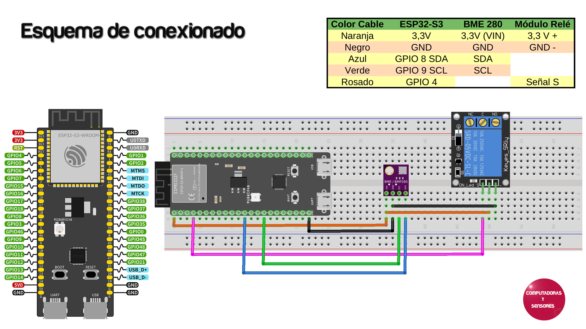

# ESP32-S3 BME280 Relay

Esquema de conexionado correspondiente al Capítulo 168 en YouTube de Computadoras y Sensores

# Código a ingresar

Ver archivo codigo.txt

# Paso a paso

Video en YouTube: https://youtu.be/2YKKINFG6DQ
